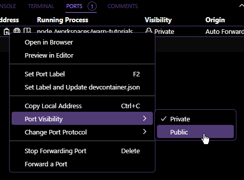

# Warp Contract Tutorials

Examples run on GitHub Codespaces.

SmartWeave contracts based on [Warp Academy tutorials](https://academy.warp.cc/tutorials/ardit/introduction/intro).

- [Hello World](hello-world/contract.js)
- [Ardit](ardit/contract.js)

Also, Warp SDK scripts for deployment.

- [Create Wallet](scripts/create-wallet.js)
- [Deploy Contract](scripts/deploy-contract.js)
- [Call Contract](scripts/call-contract.js)

## Prerequisites

[Node.js](https://nodejs.org/en)

## Setup

Install dependencies:

    $ npm i

## Scripts

### start

    $ npm start <CONTRACT_NAME>

- starts ArLocal on port `8888`
- creates 3 wallets (admin, user1, and user2)
- deploys contract on ArLocal with admin wallet
- starts Vite on port `8080` to serve a web app that uses the contract

> Note: Make sure you set the visibility of port `8888` to public in Codespace.
> 
